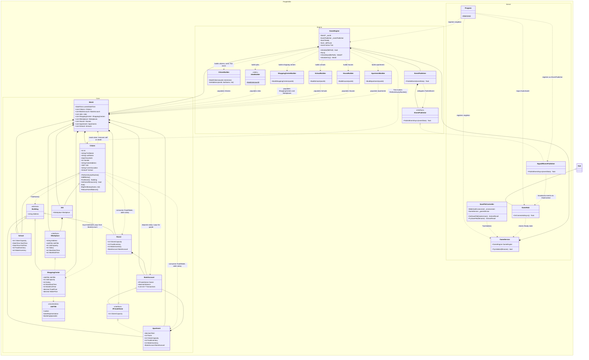

PeopleVille is a simulation environment that simulates the daily lives of citizens in a corporate society.

Citizens live in their homes, go to work or school, return home and eat.
This repeats.

```mermaid
classDiagram
    %% ===== Core Models =====
    namespace PeopleVille.Core {
        class World {
            +DateTime currentDateTime
            +List~Citizen~ Citizens
            +List~BankAccount~ BankAccount
            +List~Job~ Jobs
            +List~ShoppingCenter~ ShoppingCenters
            +List~IWorkplace~ Workplaces
            +List~House~ Houses
            +List~Apartment~ Apartments
            +List~School~ Schools
        }

        class Citizen {
            +int Id
            +string FirstName
            +string LastName
            +DateTime Birth
            +int Gender
            +string HomeAddress
            +Job? Job
            +string CurrentLocation
            +School? School
            +PerformHourlyRoutine()
            -AddMoney()
            -FindHome() Building
            -GetHomeResources() bool
            -Eat()
            -BegForMoney(home, rnd)
            -ReduceHomeBalance()
        }

        class Job {
            +IWorkplace Workplace
        }

        class BankAccount {
            +IPrivateHome Owner
            +decimal Balance
            +List~int~? Transactions
        }

        class Building {
            <<abstract>>
            +string Address
        }

        class House {
            +int CitizenCapacity
            +int FoodInventory
            +int WaterInventory
            +BankAccount BankAccount
        }

        class Apartment {
            +decimal Rent
            +int Floors
            +int CitizenCapacity
            +int FoodInventory
            +int WaterInventory
            +BankAccount BankAccount
        }

        class ShoppingCenter {
            +JobTitle JobTitle
            +int JobCapacity
            +int Salary
            +int WorkStartTime
            +int WorkEndTime
            +decimal FoodPrice
            +decimal WaterPrice
        }

        class School {
            +int CitizenCapacity
            +DateTime StartTime
            +DateTime EndTime
            +int FoodInventory
            +int WaterInventory
        }

        class IWorkplace {
            <<interface>>
            +string Address
            +JobTitle JobTitle
            +int JobCapacity
            +int Salary
            +int WorkStartTime
            +int WorkEndTime
        }

        class IPrivateHome {
            <<interface>>
            +int CitizenCapacity
        }

        class JobTitle {
            <<enumeration>>
            Cashier
            SalesRepresentative
            MarketingSpecialist
        }
    }

    %% ===== Engine =====
    namespace PeopleVille.Engine {
        class GameEngine {
            -World? _world
            -EventPublisher _eventPublisher
            +bool Ready
            +bool _doPause
            +event Action Tick
            +Initialize(filePath) bool
            +Run()
            +CheckSave(filePath) World?
            +InitializeCity() World
        }

        class EventPublisher {
            +PublishEvent(eventData) Task
        }

        class IEventPublisher {
            <<interface>>
            +PublishEventAsync(eventData) Task
        }

        class CitizenBuilder {
            +BuildCitizens(world, tickAction)
            -GetAddress(world, lastName, rnd)
        }

        class JobsBuilder {
            <<static>>
            +BuildJobs(world)$
        }

        class ShoppingCenterBuilder {
            +BuildShoppingCenters(world)
        }

        class SchoolBuilder {
            +BuildSchools(world)
        }

        class HouseBuilder {
            +BuildHouses(world)
        }

        class ApartmentBuilder {
            +BuildApartments(world)
        }
    }

    %% ===== Server =====
    namespace PeopleVille.Server {
        class Program {
            +Main(args)$
        }

        class GameService {
            +GameEngine GameEngine
            +TryInitialize(filename) bool
        }

        class GameHub {
            +OnConnectedAsync() Task
        }

        class SignalREventPublisher {
            +PublishEventAsync(eventData) Task
        }

        class SaveFileController {
            -IWebHostEnvironment _environment
            -GameService _gameService
            +GetSaveFileDataAsJson() IActionResult
            +TrySaveFile(filename) IActionResult
        }
    }

    %% ===== Inheritance / Implementation =====
    Building <|-- House
    Building <|-- Apartment
    Building <|-- ShoppingCenter
    Building <|-- School
    IPrivateHome <|.. House
    IPrivateHome <|.. Apartment
    IWorkplace <|.. ShoppingCenter
    IEventPublisher <|.. SignalREventPublisher
    Hub <|-- GameHub

    %% ===== Composition / Aggregation =====
    World *-- Citizen
    World *-- BankAccount
    World *-- Job
    World *-- ShoppingCenter
    World *-- IWorkplace
    World *-- House
    World *-- Apartment
    World *-- School

    House *-- BankAccount
    Apartment *-- BankAccount
    Job *-- IWorkplace
    Citizen o-- Job
    Citizen o-- School
    BankAccount o-- IPrivateHome
    ShoppingCenter ..> JobTitle

    %% ===== Flow: Citizen behavior =====
    Citizen ..> World : reads state / removes self on death
    Citizen ..> House : consumes Food/Water, adds salary
    Citizen ..> Apartment : consumes Food/Water, adds salary
    Citizen ..> ShoppingCenter : buys food/water, pays from BankAccount
    Citizen ..> BankAccount : deposits salary / pays for goods
    Citizen ..> Building : FindHome()

    %% ===== Flow: Engine =====
    GameEngine *-- World
    GameEngine *-- EventPublisher
    EventPublisher *-- IEventPublisher
    GameEngine ..> CitizenBuilder : builds citizens, wires Tick event
    GameEngine ..> JobsBuilder : builds jobs
    GameEngine ..> ShoppingCenterBuilder : builds shopping centers
    GameEngine ..> SchoolBuilder : builds schools
    GameEngine ..> HouseBuilder : builds houses
    GameEngine ..> ApartmentBuilder : builds apartments
    GameEngine ..> Citizen : Tick invokes PerformHourlyRoutine()
    CitizenBuilder ..> World : populates Citizens
    JobsBuilder ..> World : populates Jobs
    ShoppingCenterBuilder ..> World : populates ShoppingCenters and Workplaces
    SchoolBuilder ..> World : populates Schools
    HouseBuilder ..> World : populates Houses
    ApartmentBuilder ..> World : populates Apartments

    %% ===== Flow: Server =====
    Program ..> GameService : registers singleton
    Program ..> GameEngine : registers singleton
    Program ..> SignalREventPublisher : registers as IEventPublisher
    Program ..> GameHub : maps /hubs/match
    SaveFileController ..> GameService : TryInitialize()
    GameService *-- GameEngine
    GameHub ..> GameService : checks Ready state
    SignalREventPublisher ..> GameHub : broadcasts events via IHubContext
    EventPublisher ..> IEventPublisher : delegates PublishEvent
```
